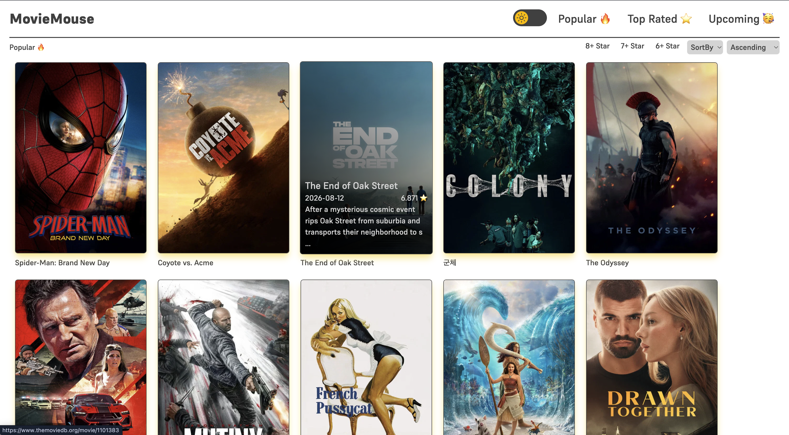

# 🎬 MovieMouse

A minimal movie discovery platform built with **React.js** and the **TMDB API**. Users can browse popular movies, filter them by rating, and sort them by release date or rating.

## 🚀 Live Demo

[https://movie-mouse-henna.vercel.app/](YOUR_VERCEL_LINK_HERE)

## 🖼️ Preview



## ✨ Features

- 🎬 Fetches popular movies from TMDB API
- ⭐ Filter movies by rating
- ↕️ Sort by release date and rating
- 🔼 Ascending / descending sorting
- 🃏 Reusable React components
- ✨ Movie information hover effects
- 🎨 Styled with Tailwind CSS
- 🌙 Dark mode toggle UI _(functionality planned for a future project)_

## 🛠️ Tech Stack

- React.js
- JavaScript
- Tailwind CSS
- TMDB API
- Lodash
- Vite
- Vercel

## 🧠 What I Learned

- React functional components & props
- `useState` and `useEffect`
- API integration and asynchronous data fetching
- Managing and updating application state
- Filtering and sorting data
- Component-based architecture
- Tailwind CSS styling and transitions
- Building and deploying a React/Vite application with Vercel

## 📁 Structure

```text
src/
├── components/
│   ├── Navbar.jsx
│   ├── DarkMode.jsx
│   ├── Movielist.jsx
│   ├── Moviecard.jsx
│   └── FilterGroup.jsx
│
├── App.jsx
└── main.jsx
```

## 📌 About

MovieMouse was built as part of my **React learning journey**, focusing on working with APIs, managing state, creating reusable components, and deploying a frontend application to production.
